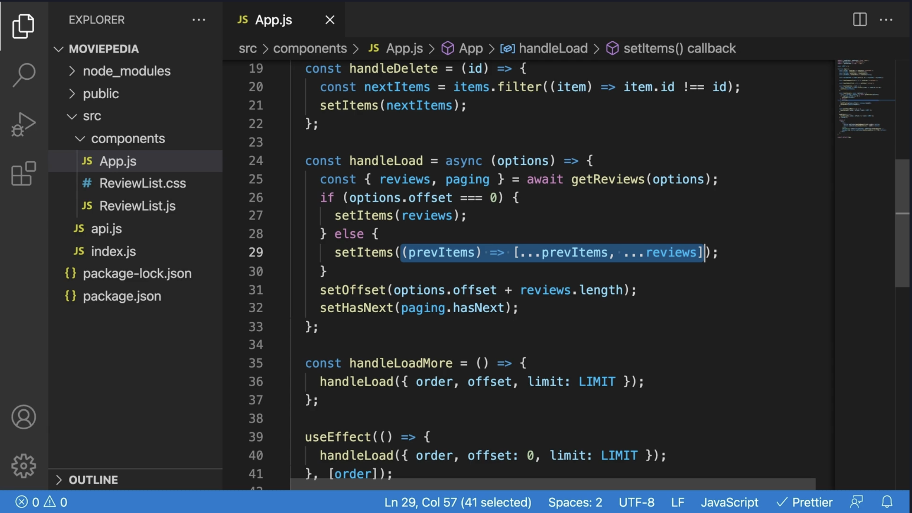

# useState

참고 - 코드잇 강의 리액트로 데이터 다루기:[비동기로 state를 변경할 때 주의할 점](https://www.codeit.kr/topics/handling-data-with-react/lessons/5048)



Q. setState 함수에서 콜백을 사용하여 state를 업데이트하는 과정이 어떻게 되나요? (어떻게 리액트가 현재 시점의 state 값을 파라미터 prevItems로 넘겨줄 수 있는 건가요?)

## 클로저(Closure)

클로저란, 함수가 선언된 환경을 기억하는 구조를 일컫습니다. 예를 들어, `inner` 함수를 리턴하도록 선언된 `outer` 함수가 호출되어 메모리 상에서 사라지더라고, 해당 `outer` 함수가 선언된 환경을 기억하여 `a`라는 변수가 업데이트 됩니다.

```js
function outer() {
  var a = 1;
  function inner() {
    a++;
    console.log(a);
  }
  return inner;
}

var closure = outer();
closure(); // 2
closure(); // 3
```

### useState의 간략한 과정

`useState`를 구현해보면 아래와 같습니다.

setState 함수는 전달된 파라미터의 타입 연산을 통해, 값이라면 파라미터 값으로 업데이트를 하고, 콜백 함수라면 콜백 함수에 현재 state를 전달하여 받은 결과값으로 업데이트를 합니다.

```js
function useState(initialValue) {
  let state = initialValue;

  const getState = () => state; // state 값을 반환하는 함수

  const setState = (newValue) => {
    // state 값을 업데이트하는 함수
    state = typeof newValue === "function" ? newValue(state) : newValue;
    console.log("State updated:", state);
  };

  return [getState, setState]; // getter setter 함수 배열 반환
}

const [getCount1, setCount1] = useState(0);
const [getCount2, setCount2] = useState(10);

setCount1(1);
setCount2(20);

console.log(getCount1()); // 1
console.log(getCount2()); // 20

setCount1((prev) => prev + 1);
setCount2((prev) => prev + 10);

console.log(getCount1()); // 2
console.log(getCount2()); // 30
```
